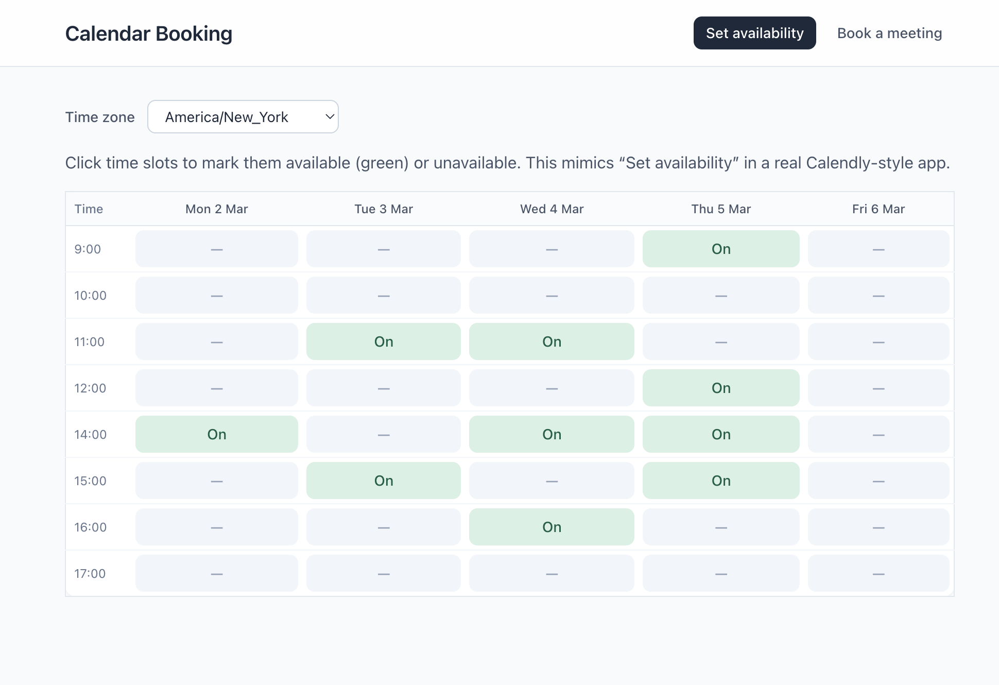
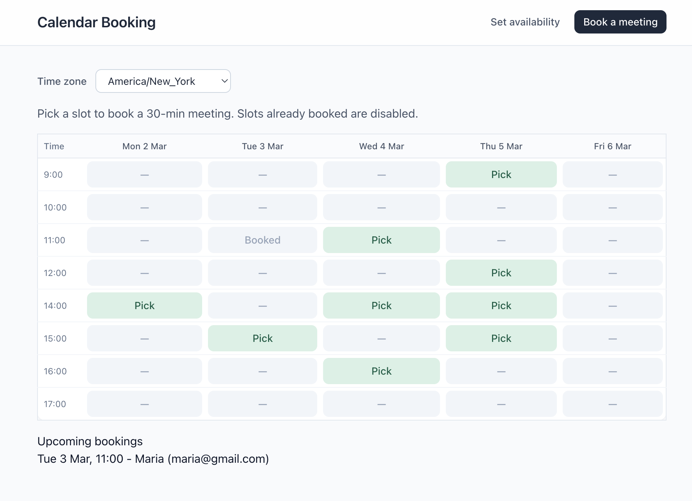
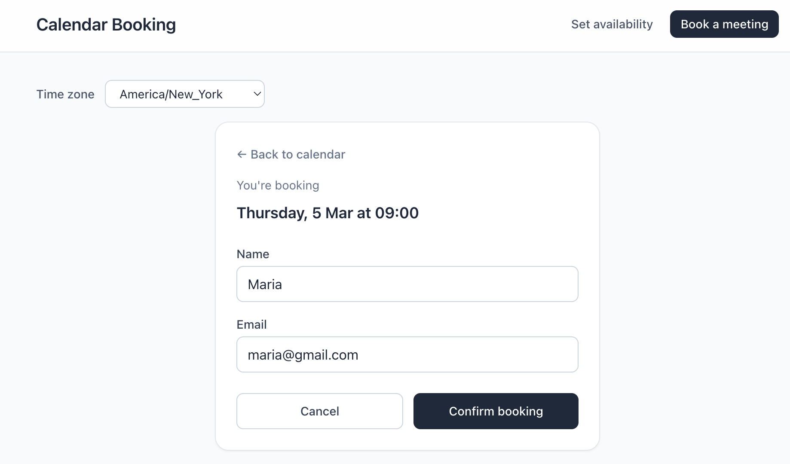
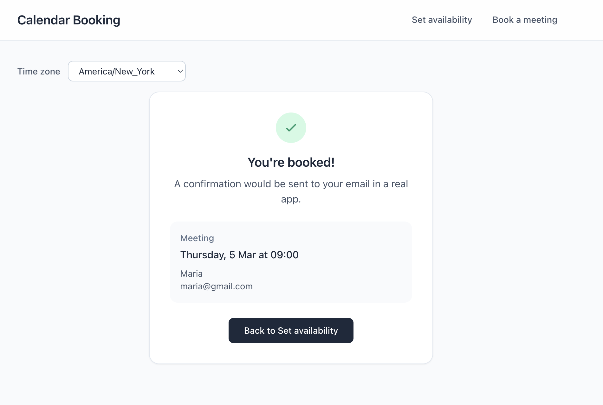

# React: Calendar Booking App

## Environment

- **React Version:** 19.x
- **Node Version:** ^18.x (or ^20.x recommended)
- **Frontend (Vite) default port:** 5173
- **Backend (Express) default port:** 3001

🔗 **Live Demo:**  
[Click here to view the deployed app](https://placeholder.vercel.app/) _to be added_

_Planned: a deployed **frontend-only** demo. For the full flow (setting availability and booking), you must run the backend locally – see “How to run locally” below._

## Project Specifications

**Calendly-style calendar booking app.** The host sets weekly availability; guests pick a slot, fill in their details, and see a confirmation screen. Time zones are handled on both backend and frontend, and confirmation emails are mocked in the backend logs (no real email provider required).

### Calendar & Booking Views

### Setting availability



### Booking meeting



### Confirmation



### Booked



The app lets users:

- Switch between **“Set availability”** and **“Book a meeting”** views
- Define availability on a **week grid** (Monday–Friday, selected hours)
- View **only free slots** when booking (booked slots are disabled)
- See times in a **selected time zone** while all data is stored in UTC
- Submit a booking with **name and email** and see a confirmation card
- Log a **mock confirmation email** in the backend console (subject, to, body)

The frontend is built with **React**, **TypeScript**, **Vite**, **Tailwind CSS**, and **date-fns/Luxon**. The backend is a small **Express + SQLite** API.

## Tech stack

| Layer    | Stack                                                     |
| -------- | --------------------------------------------------------- |
| Frontend | React 19, TypeScript, Vite, Tailwind CSS, date-fns, Luxon |
| Backend  | Node.js, Express, TypeScript (tsx), better-sqlite3, Luxon |

## API base URL

The frontend talks to the backend at:

- **Default:** `http://localhost:3001`
- You can change this in `frontend/src/api.ts` or via a `VITE_API_URL` env if you add one when deploying.

## Main API endpoints

| Endpoint                                    | Description                                                                                    |
| ------------------------------------------- | ---------------------------------------------------------------------------------------------- |
| `GET /`                                     | Simple health/info endpoint                                                                    |
| `GET /api/availability?from=&to=&timezone=` | Returns available slots for the given date range, converted from UTC to the requested timezone |
| `PUT /api/availability`                     | Replaces all availability slots. Body: `{ slots: string[], timezone: string }`                 |
| `GET /api/bookings`                         | Lists all bookings (stored in SQLite)                                                          |
| `POST /api/bookings`                        | Creates a booking. Body: `{ slot: utcISO, guestName, guestEmail, timezone? }`                  |

All slots are stored in the database as **UTC ISO strings**. The frontend converts between local time and UTC using Luxon helpers.

## How to run locally

### Backend

```bash
cd backend
npm install
npm run dev
```

This starts the Express API on [http://localhost:3001](http://localhost:3001). A `calendar.db` SQLite file will be created in the `backend` folder.

### Frontend

```bash
cd frontend
npm install
npm run dev
```

Then open [http://localhost:5173](http://localhost:5173). Make sure the backend is running on port 3001 so the app can load availability and bookings.

## Build for production

### Backend

```bash
cd backend
npm run build
node dist/index.js
```

### Frontend

```bash
cd frontend
npm run build
npm run preview
```

For portfolio purposes, the typical setup is:

- Deploy the **frontend** (optional) on Vercel/Netlify/Render (static build from `frontend/dist`).
- Run the **backend** locally on your machine at `http://localhost:3001` when you demo the app.

If you later deploy the backend as well, point the frontend to the deployed API URL (e.g. via `VITE_API_URL`) and rebuild.
